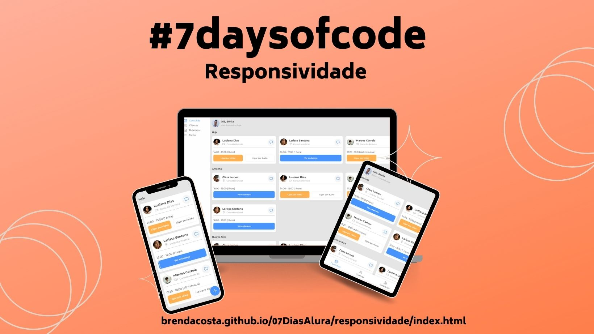

# #7DaysOfCode - Responsividade
Seguindo a ideia do Mobile First, o projeto foi desenvolvido seguindo as especificações dada pela Natália F. Dev no desafio [#7DaysOfCode da Alura - Responsividade](https://www.figma.com/file/4OjHFmeHAgfX2JpRymOeA0/7days---Responsividade?node-id=6%3A622)

> Uma clínica médica te contratou para desenvolver uma página responsiva, para que seus médicos e médicas contratados pudessem ter controle sobre todas suas consultas agendadas.

Conceitos abordados no projeto:

* Transformação de um layout do Figma em código
* Mobile First
* Botões flutuantes
* Unidades relativas
* Media queries
* Layout em colunas
* Refatoração

### [Link para conferir o resultado](https://brendacosta.github.io/07DiasAlura/responsividade/index.html)
